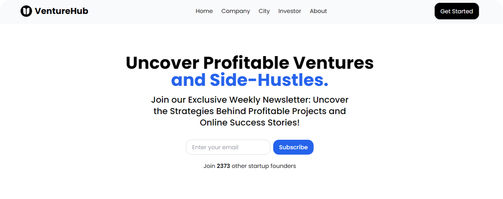

# VentureHub

Your Interactive Hub for Startup Discovery!

[Live Website](https://venturehub-react.vercel.app)

## 👋 Introduction

VentureHub is a MERN stack application designed to showcase various startups, providing users with an interactive
platform to **search**, **filter**, **submit** startup data. 

## 🌟 Features

### 🌐 Frontend

- Visually appealing grid of card-based UI displaying startups.

- RadixUI Modal for displaying detailed startup information

- Dynamic Filter Menu for filter startup based on their category

- Button to submit new Startup company made with RadixUI dialog

- Search Functionality for searching startups based on keywords.

- Email Subscription form to get newly added startup information in email

### 🛢️ Backend

- Mongoose used for simplifying MongoDB interactions with schema structure, data validation, and middleware support.

- Cors is used for secure communication between client and server

- Morgan is used for logging HTTP request in console.

## 📦 Packages

### 🌐 Frontend

- Formspree React
- Radix UI
- Tanstack Query
- Axios
- Proptypes
- React Datepicker
- React Hot Toast
- React Hook Form
- React Loading Skeleton
- React Feather

### 🛢️ Backend

- ExpressJS
- Mongoose
- Morgan
- Cors

